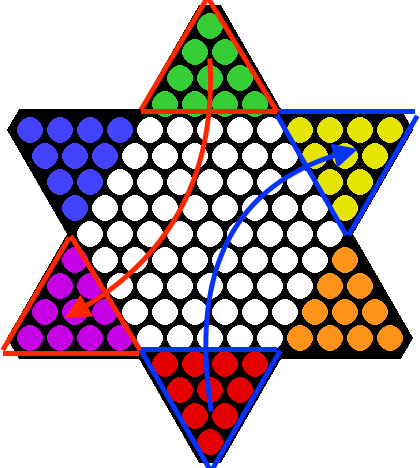

# Game Design and Engineering

## Game Reports: Kishan Sangani: 201501053
### Team Member 2: Sriya Deepika : 20161186

## Checkers

### Rule Change:

We introduced a new rule for called _Inverted Jump_.

- Except pawns and king, every other piece can jump over at most one other piece, either of player or their opponent.
- Other rules of game apply as it is.

### Type of rule change:

The new rule is **operational** rule.

### Reason for this change of rule

- The knight was the only piece that could jump over other piece in the board.
- We wanted to give this power even to other important pieces like rook, bishop and queen to enhance their power.

### Game Play
- This change in rule make the game more interesting as there are multiple ways of giving check despite having blocking pieces surrounding the king.
- It makes capture more easier in the game.

### Player Behavior
- Player will now have more attention towards the pawns, of their as well as their opponent as they may be crucial _Wall_ to the _Inverted Jump_ rule change.
- Not only this is advantageous, but a player can lose their own piece if they are not careful.

### Duration of game
- The duration of game remained same but the number of steps were reduced.
- The reason for the reduction in number of steps is that capture and check(probably checkmate) is easier, while the duration of the game remains same because there are multiple capture scenerious possible with a single layer of blockage of pieces.

### Game Output
- The game output remains unaffected, however multiple new moves are possible.

### Mathematical Solutions
- As presented in the research article "THE SHORTEST GAME OF CHINESE CHECKERS AND RELATED PROBLEMS
" by George I. Bell, the shortest game remains same.
- However the average length is considerably reduced and the game is more asymmetric than the original game.
